# Start with the Oracle Forms/Reports 12.2.1.3
Environment:  
VirtualBox machine 4Gb Memory  
OS Windows 7 SP1 Professional 64bit  
Windows user "oracle" in "Administrators" group
Oracle XE 18c pluggable database for FMW Repository(Fusion Middleware Repository)  

## 1.Check system requirements
link: https://www.oracle.com/technetwork/middleware/fmw-122130-certmatrix-3867828.xlsx  
## 2.Download software  
### 2.1.Oracle JDK 1.8.0_131
link: https://www.oracle.com/technetwork/java/javase/downloads/java-archive-javase8-2177648.html  
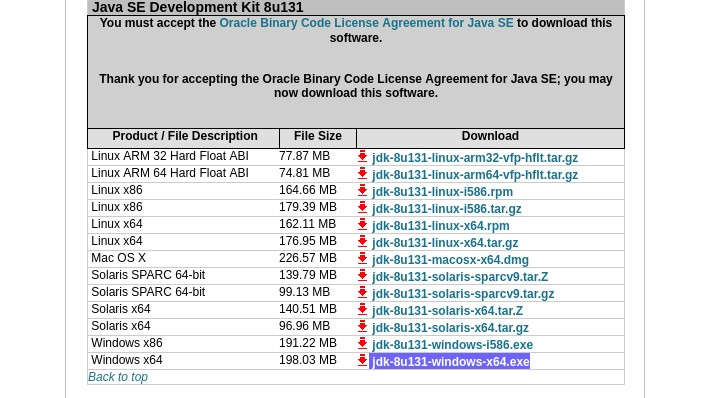  


### 2.2.Microsoft Visual C++  
link: https://www.microsoft.com/en-us/download/details.aspx?id=30679  
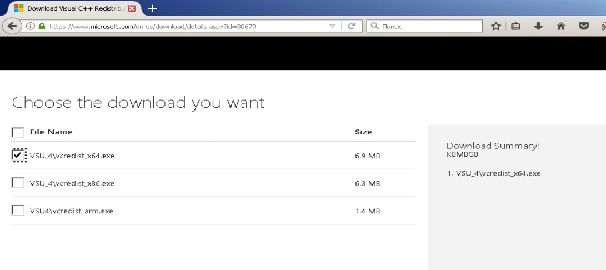  


### 2.3.ADF(Application Development Framework) Infrastructure 12.2.1.3
link: https://www.oracle.com/technetwork/developer-tools/adf/downloads/index.html  
  


### 2.4.Oracle Forms 
link: https://www.oracle.com/downloads/
navigation:  “Developer Downloads” chapter > “Middleware” chapter > "Forms and Reports Services" link  
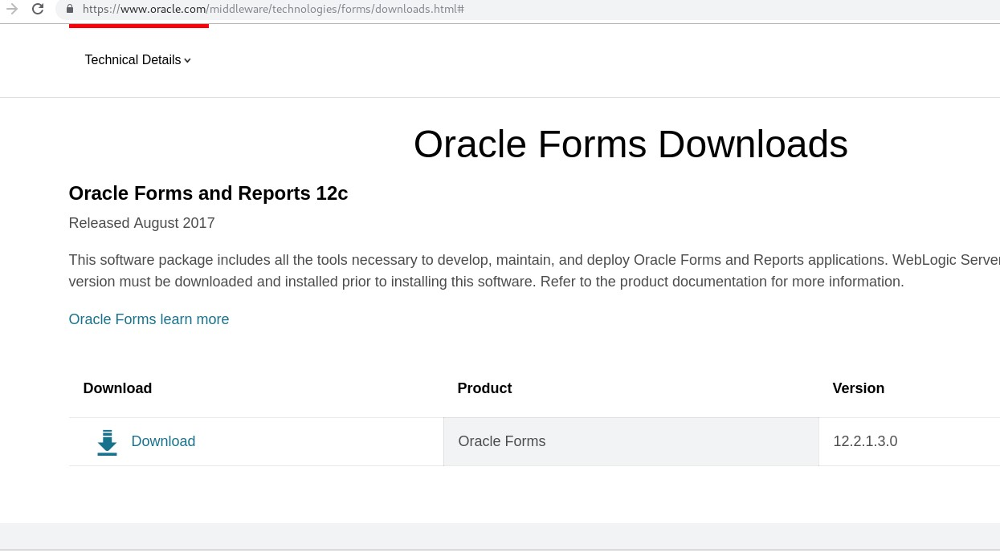  
<p align="center">Pic 2.4.1: Oracle Forms Download</p>  


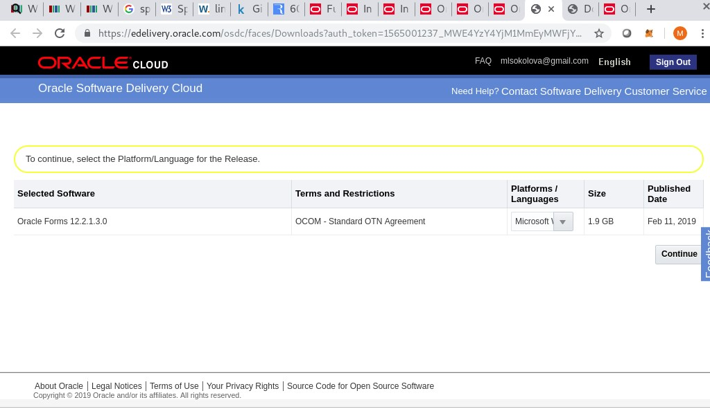  
<p align="center">Pic 2.4.2: Oracle Forms Download, edelivery.oracle.com</p>  


  
<p align="center">Pic 2.4.3: License Agreement</p>  


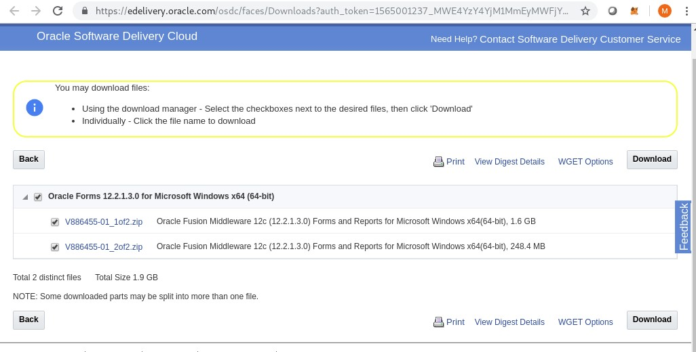  
<p align="center">Pic 2.4.4: Forms Download, zip files, edelivery.oracle.com</p>  


Unzip both zip files into thee same folder  


## 3.Install Oracle JDK to the folder with the "8.3" name  
"8.3" name means following: https://en.wikipedia.org/wiki/8.3_filename  
  
<p align="center">Pic 3.1: JDK folder name</p>  


  
<p align="center">Pic 3.2: JRE folder name</p>  


## 4.Install Microsoft Visual C++  
Restart computer after installation of Microsoft Visual C++  


## 5.Install ADF Infrastructure   
Run cmd as Administrator  
Change directory to the folder with unpacked ADF Infrastructure distro  
Run ADF Infrastructure Installer. Example:  
```
e:\app\java\jdk1.8.0_131\bin\java.exe -jar fmw_12.2.1.3.0_infrastructure.jar
```
  
<p align="center">Pic 5.1: ADF Infrastructure Installation. Select Oracle Home folder</p>  


## 6.Install Oracle Forms 12.2.1.3  
run setup_fmw_12.2.1.3.0_fr_win64.exe as Administrator  
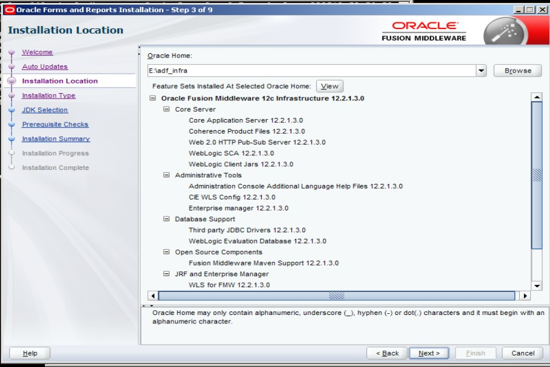  
<p align="center">Pic 6.1: Forms Installation. Select ADF Infrastructure Oracle Home</p>  

Select installation type: Forms and Reports Deployment  
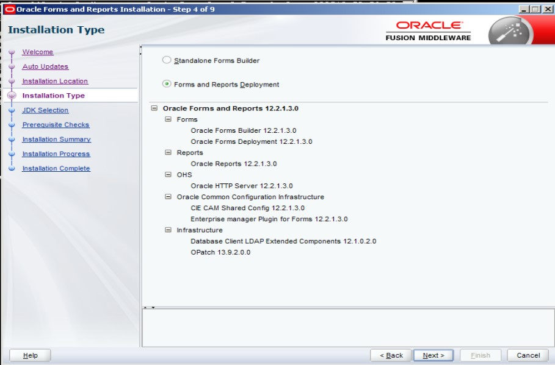  
<p align="center">Pic 6.2: Forms Installation. Select Installation type</p>  


Select JDK  
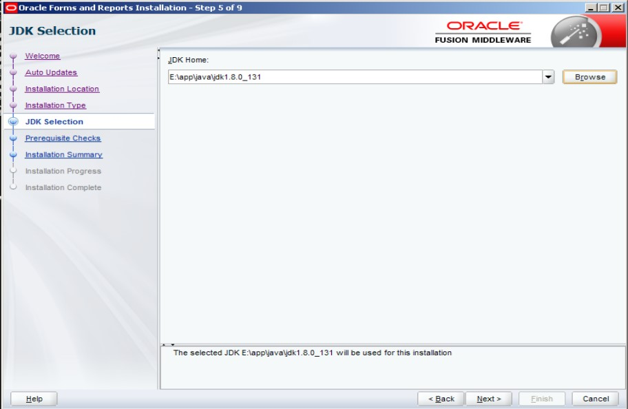  
<p align="center">Pic 6.3: Forms Installation. JDK selection</p>  


## 7.Create Fusion Middleware Repository

Run Repository Creation Utility(RCU) from ADF Infrastructure ORACLE_HOME\oracle_common\bin\rcu.bat  
Select "System Load and Product Load"  
  
<p align="center">Pic 7.1: RCU. Select "System Load and Product Load"</p>  


Edit database connection details  
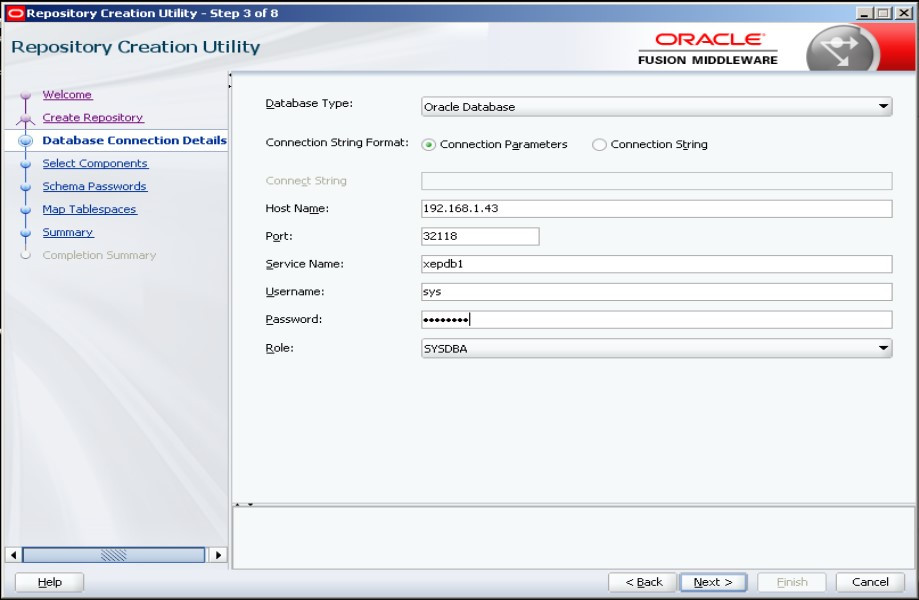  
<p align="center">Pic 7.2: RCU. Detabase Connection Details</p>  

Provide schema prefix and select following components:  
- Oracle Platform Security Services  
- User Messaging Service (UMS)  
- Audit Services  
- Audit Services Append  
- Audit Services Viewer  
Additional dependent components will automatically be selected  
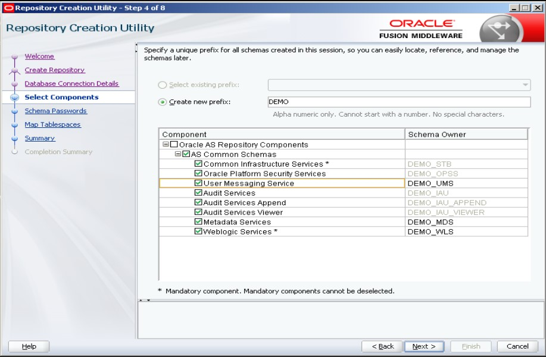  
<p align="center">Pic 7.3: RCU. Select Components</p>  
Then set schema passwords, map tablespaces and waiting until load processes will complete

## 8.Configure Fusion Middleware Services
Run Configuration Wizard from ADF Infrastructure ORACLE_HOME\oracle_common\common\bin\config.cmd  
Select Create Domain as Configuration Type  
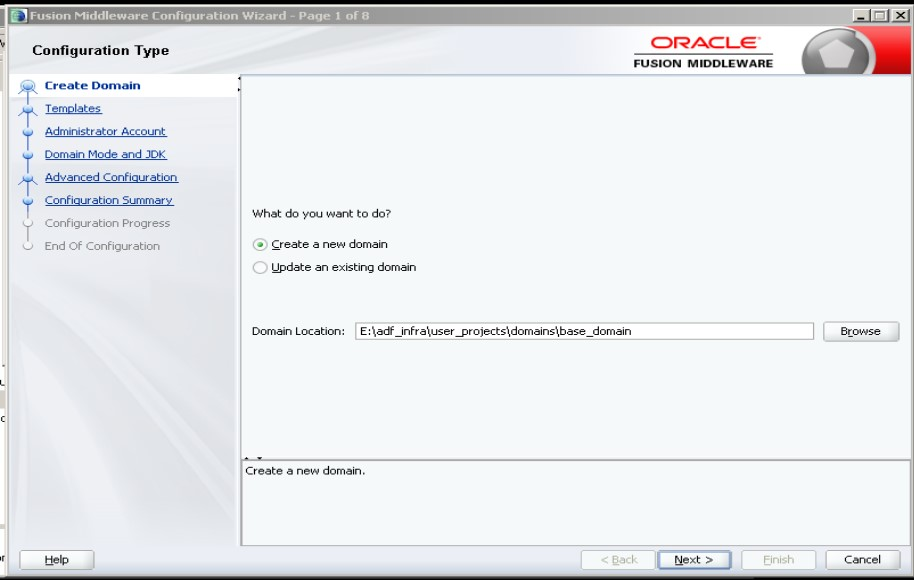  
<p align="center">Pic 8.1: Configure FMW. Create domain</p>  

Select following templates: Oracle Forms; Oracle Enterprise Manager; Oracle JRF   
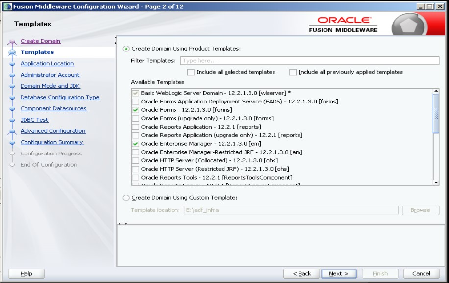  
<p align="center">Pic 8.2: Configure FMW. Select templates</p>  


Keep the default value in the Application Location screen  

Enter administration username and password of WebLogic Domain in the Administrator Account screen  

Configure connection details to the Fusion Middleware Repository for JDBC Datasources  
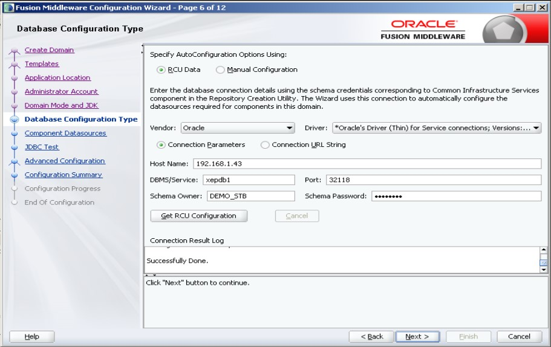  
<p align="center">Pic 8.3: Configure FMW. Fusion Middleware Repository connection details</p>  


## 9.Configure Forms Environment variables  
Navigation: Windows Start > Computer > Properties >Advanced System Settings > Environment Variables  
Variables: ORACLE_HOME, FORMS_BUILDER_CLASSPATH  
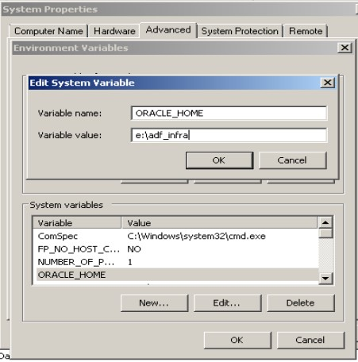  
<p align="center">Pic 9.1: Configure Forms Environment Variables</p>  


  
<p align="center">Pic 9.2: Configure Forms Environment Variables</p>  


Value for the FORMS_BUILDER_PATH:  
```
FORMS_BUILDER_PATH=%ORACLE_HOME%\jlib\frmbld.jar;%ORACLE_HOME%\jlib\importer.jar;%ORACLE_HOME%\jlib\debugger.jar;%ORACLE_HOME%\jlib\utj.jar;%ORACLE_HOME%\jlib\ewt3.jar;%ORACLE_HOME%\jlib\share.jar;%ORACLE_HOME%\jlib\dfc.jar;%ORACLE_HOME%\jlib\ohj.jar;%ORACLE_HOME%\jlib\help-share.jar;%ORACLE_HOME%\jlib\oracle_ice.jar;%ORACLE_HOME%\jlib\jewt4.jar;%ORACLE_HOME%\forms\java\frmwebutil.jar;%ORACLE_HOME%\forms\java\frmall.jar
```

## 10. Set up TNS Alias (tnsnames.ora)
Run Oracle Net Manager
Navigation: Windows Start > All Programs > <your OracleHome> Configuration and Migration Tools > Net Manager
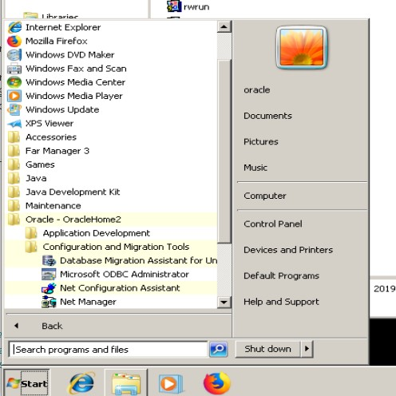  
<p align="center">Pic 10.1: Set up TNS Alias. Run Oracle Net Manager</p>  


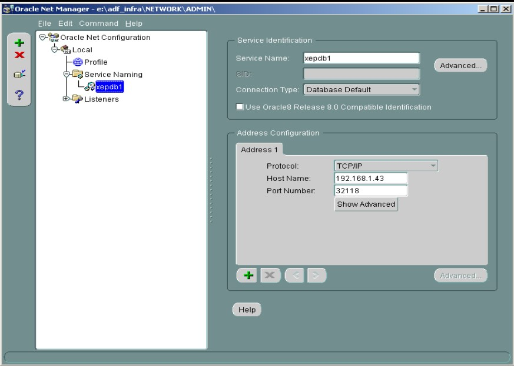  
<p align="center">Pic 10.2: Set up TNS Alias. Oracle Database connection details</p>  


References:  
Documentation: https://docs.oracle.com/middleware/12213/formsandreports/index.html  
System requirements: https://www.oracle.com/technetwork/middleware/fmw-122130-certmatrix-3867828.xlsx  
Download Oracle JDK 1.8.0_131: https://www.oracle.com/technetwork/java/javase/downloads/java-archive-javase8-2177648.html  
Download Application Development Runtime 12.2.1.3: https://www.oracle.com/technetwork/developer-tools/adf/downloads/index.html  
Download Microsoft Visual C++: https://www.microsoft.com/en-us/download/details.aspx?id=30679  


