# Start with the Oracle Forms/Reports 12.2.1.3  
Oracle Forms is specific tool for the build user interface for manipulation with the data in the Oracle Database Tables.  
This document contains step-by-step HOWTO:  
- download required software  
- install Oracle Application Development Framework Infrastructure  
- install Oracle Forms/Reports  
- create user interface(form) upon the demo table  
- run Weblogic  
- run Oracle Form  

## Notes 
1.For develop and run Oracle Forms two Oracle distributives needed:  
- Oracle ADF(Application Development Framework) Infrastructure which included Weblogic  
- Oracle Forms/Reports  
2.Run Forms Builder after Wedlogic Domain Configuration  
3.Run Oracle Forms using Java Web Start

Environment:  
- VirtualBox machine 4Gb Memory  
- OS Windows 7 SP1 Professional 64bit  
- Windows user "oracle" in "Administrators" group  
- Oracle XE 18c pluggable database  
- Mozilla Firefox browser  

## 1.Check system requirements
link: https://www.oracle.com/technetwork/middleware/fmw-122130-certmatrix-3867828.xlsx  
## 2.Download software  
### 2.1.Oracle JDK 1.8.0_131
link: https://www.oracle.com/technetwork/java/javase/downloads/java-archive-javase8-2177648.html  
  


### 2.2.Microsoft Visual C++  
link: https://www.microsoft.com/en-us/download/details.aspx?id=30679  
  


### 2.3.ADF(Application Development Framework) Infrastructure 12.2.1.3
link: https://www.oracle.com/technetwork/developer-tools/adf/downloads/index.html  
  


### 2.4.Oracle Forms 
link: https://www.oracle.com/downloads/
navigation:  “Developer Downloads” chapter > “Middleware” chapter > "Forms and Reports Services" link  
  
<p align="center">Pic 2.4.1: Oracle Forms Download</p>  


  
<p align="center">Pic 2.4.2: Oracle Forms Download, edelivery.oracle.com</p>  


  
<p align="center">Pic 2.4.3: License Agreement</p>  


  
<p align="center">Pic 2.4.4: Forms Download, zip files, edelivery.oracle.com</p>  


Unzip both zip files into thee same folder  


## 3.Install Oracle JDK to the folder with the "8.3" name  
"8.3" name means following: https://en.wikipedia.org/wiki/8.3_filename  
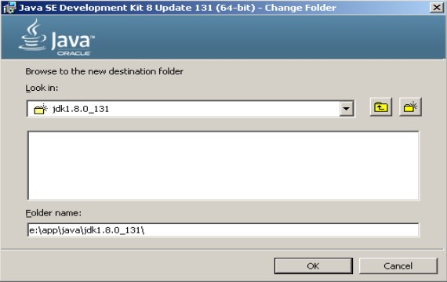  
<p align="center">Pic 3.1: JDK folder name</p>  


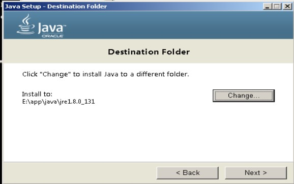  
<p align="center">Pic 3.2: JRE folder name</p>  


## 4.Install Microsoft Visual C++  
Restart computer after installation of Microsoft Visual C++  


## 5.Install ADF Infrastructure   
Run cmd as Administrator  
Change directory to the folder with unpacked ADF Infrastructure distro  
Run ADF Infrastructure Installer. Example:  
```
e:\app\java\jdk1.8.0_131\bin\java.exe -jar fmw_12.2.1.3.0_infrastructure.jar
```
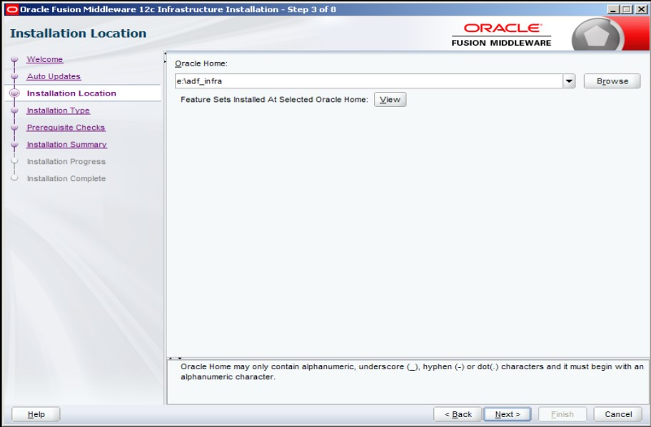  
<p align="center">Pic 5.1: ADF Infrastructure Installation. Select Oracle Home folder</p>  


## 6.Install Oracle Forms 12.2.1.3  
run setup_fmw_12.2.1.3.0_fr_win64.exe as Administrator  
  
<p align="center">Pic 6.1: Forms Installation. Select ADF Infrastructure Oracle Home</p>  

Select installation type: Forms and Reports Deployment  
  
<p align="center">Pic 6.2: Forms Installation. Select Installation type</p>  


Select JDK  
  
<p align="center">Pic 6.3: Forms Installation. JDK selection</p>  


## 7.Create Fusion Middleware Repository

Run Repository Creation Utility(RCU) from ADF Infrastructure ORACLE_HOME\oracle_common\bin\rcu.bat  
Select "System Load and Product Load"  
  
<p align="center">Pic 7.1: RCU. Select "System Load and Product Load"</p>  


Edit database connection details  
  
<p align="center">Pic 7.2: RCU. Detabase Connection Details</p>  

Provide schema prefix and select following components:  
- Oracle Platform Security Services  
- User Messaging Service (UMS)  
- Audit Services  
- Audit Services Append  
- Audit Services Viewer  
Additional dependent components will automatically be selected  
  
<p align="center">Pic 7.3: RCU. Select Components</p>  
Then set schema passwords, map tablespaces and waiting until load processes will complete

## 8.Configure Weblogic Domain
Run Configuration Wizard from ADF Infrastructure ORACLE_HOME\oracle_common\common\bin\config.cmd  
Select Create Domain as Configuration Type  
  
<p align="center">Pic 8.1: Configure FMW. Create domain</p>  

Select following templates: Oracle Forms; Oracle Enterprise Manager; Oracle JRF   
  
<p align="center">Pic 8.2: Configure FMW. Select templates</p>  


Keep the default value in the Application Location screen  

Enter administration username and password of WebLogic Domain in the Administrator Account screen  

Configure connection details to the Fusion Middleware Repository for JDBC Datasources  
  
<p align="center">Pic 8.3: Configure FMW. Fusion Middleware Repository connection details</p>  

Advanced Configuration screen: select "Admin Server", "Topology", "System Components"  
  
<p align="center">Pic 8.4: Configure FMW. Advanced Configuration</p>  

Assign WebLogic Servers to Weblogic Machine  
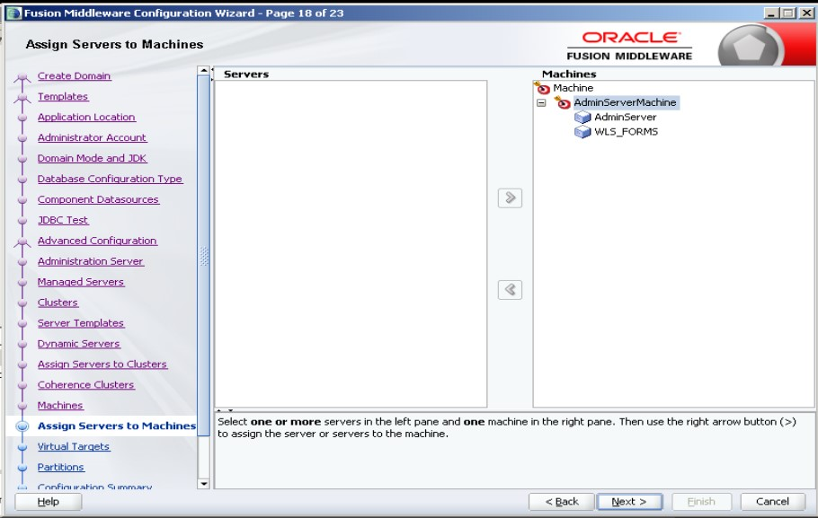  
<p align="center">Pic 8.5: Configure FMW. Assign WebLogic Servers to Machine</p>  


## 9. Set up TNS Alias (tnsnames.ora)
Run Oracle Net Manager
Navigation: Windows Start > All Programs > <your OracleHome> Configuration and Migration Tools > Net Manager
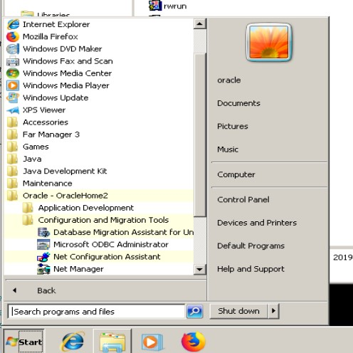  
<p align="center">Pic 9.1: Set up TNS Alias. Run Oracle Net Manager</p>  


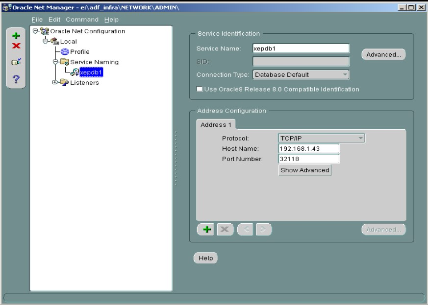  
<p align="center">Pic 9.2: Set up TNS Alias. Oracle Database connection details</p>  

"ADF Infrastructure ORACLE_HOME"\network\admin\tnsnames.ora should contain something like this:  
```
XEPDB1 =
  (DESCRIPTION =
    (ADDRESS_LIST =
      (ADDRESS = (PROTOCOL = TCP)(HOST = 192.168.1.43)(PORT = 32118))
    )
    (CONNECT_DATA =
      (SERVICE_NAME = xepdb1)
    )
  )
```


## 10. Configure Forms Server    
10.1. Create folder for your own forms, for example e:\myforms  
10.2. Edit configuration file "WebLogic Domain Folder"\config\fmwconfig\servers\WLS_FORMS\applications\formsapp_12.2.1\config\default.env  
FORMS_MODULE_PATH should include path to your own forms, for example:  
```
FORMS_MODULE_PATH=e:\myforms;%FORMS_PATH%  
```
TNS_ADMIN should include path to tnsnames.ora file, for example:  
```
TNS_ADMIN=%ORACLE_HOME%\network\admin
```

## 11. Run WebLogic  
### 11.1. Node Manager  
Execute %ORACLE_HOME%\user_projects\domains\base_domain\bin\startNodeManager.cmd as Administrator  
Message from the successfully started Node Manager:  
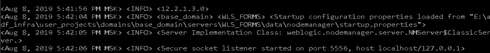  
<p align="center">Pic 11.1: Node Manager</p>  


### 11.2. Admin Server  
Execute %ORACLE_HOME%\user_projects\domains\base_domain\bin\startWebLogic.cmd as Administrator  
Message from the successfully started Admin Server:  
  
<p align="center">Pic 11.2: Node Manager</p>  


Do not close cmd windows with Node Manager and Admin Server  

### 11.3. Forms Server
URL: http://localhost:7001/console
Navigation: Environment > Servers > tab “Control”
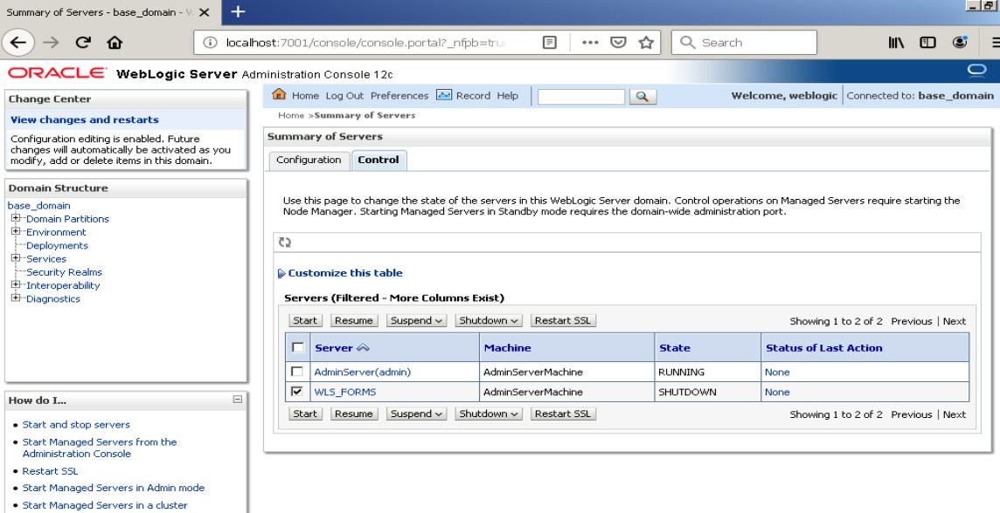  
<p align="center">Pic 11.3.1: Weblogic Console</p>  


Select WLS_FORMS and run it by “Start” button
Status of successfully started WLS_FORMS should change to "RUNNING" 
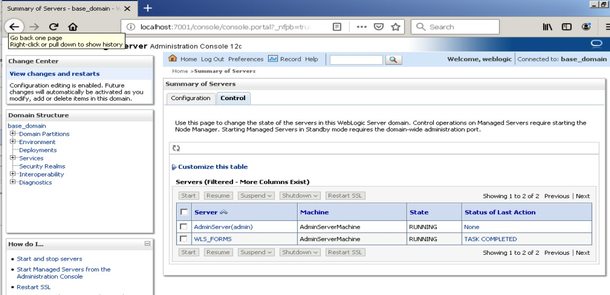  
<p align="center">Pic 11.3.2: Started Forms Server</p>  


## 11. Configure Mozilla Firefox 
Set Mozilla Firefox as default browser  
Navigation: Firefox > Options > General > Applications  
Action "Use Java(TM) Web Start Launcher" for the "JNPL File" content  
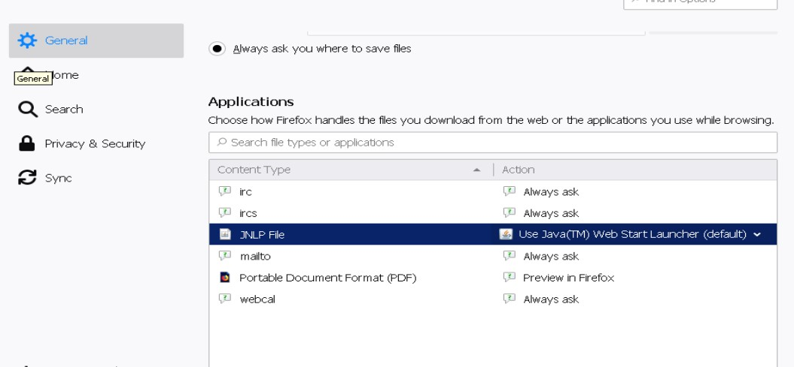  
<p align="center">Pic 10.1: Firefox. JNPL File</p>  


## 12. Create simpliest form based on the database table
### 12.1.Run Oracle Forms Builder  
Navigation: Windows Start > All Programs >  Oracle FMW 12c Domain - "domain name, see chapter 8" - 12.2.1.3.0 > Oracle Forms Developer - forms1 > Forms Builder  
Forms Builder will started, form with name MODULE1 will created  
### 12.2. Connect to Oracle Database from the Forms Builder  
Navigation: Forms Builder > File > Connect  
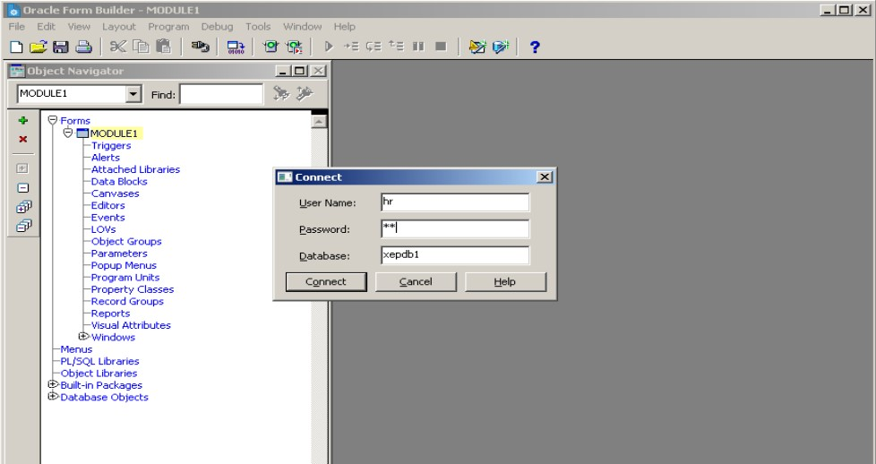  
<p align="center">Pic 12.2.1: Forms Builder. Connect to database</p>  


### 12.3. Create Data Block by the Data Block Wizard  
Navigation: right click on "MODULE1" > select Datablock Wizard  
  
<p align="center">Pic 12.3.1: Forms Builder. Create data block</p>  


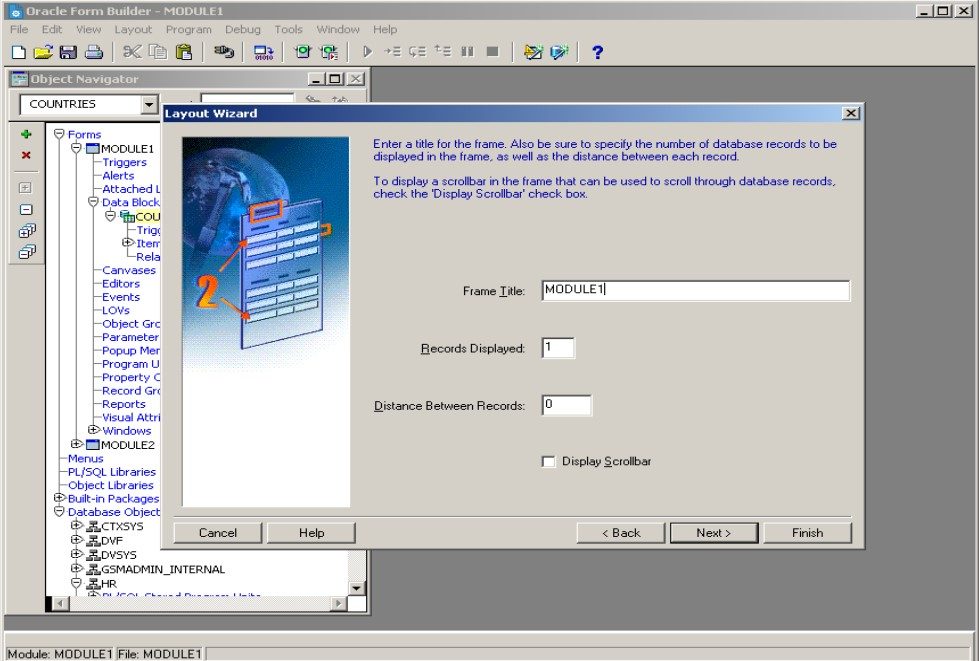  
<p align="center">Pic 12.3.2: Forms Builder. Create data block</p>  


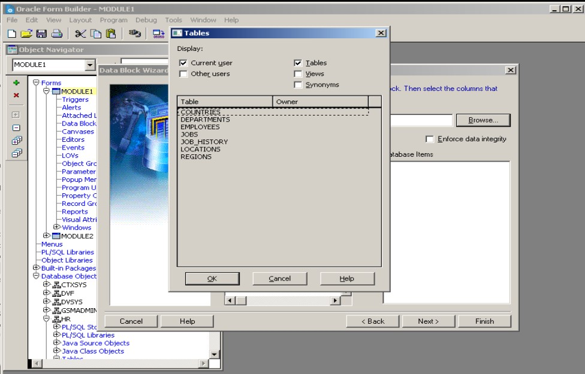  
<p align="center">Pic 12.3.3: Forms Builder. Create data block</p>  

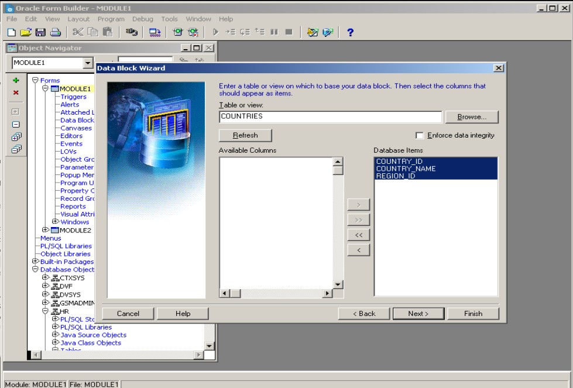  
<p align="center">Pic 12.3.4: Forms Builder. Create data block</p>  


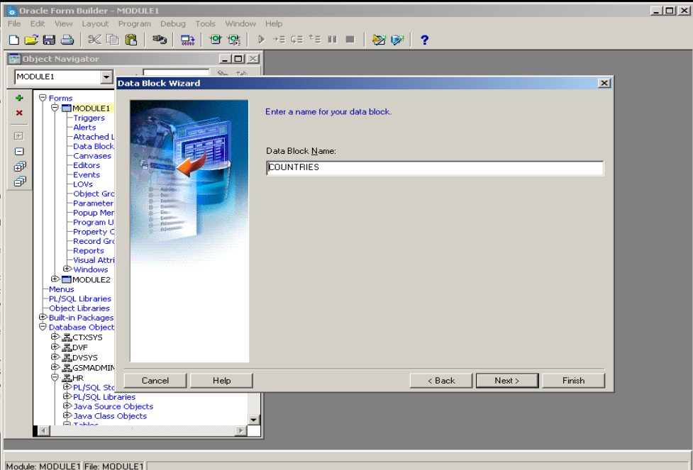  
<p align="center">Pic 12.3.5: Forms Builder. Create data block</p>  


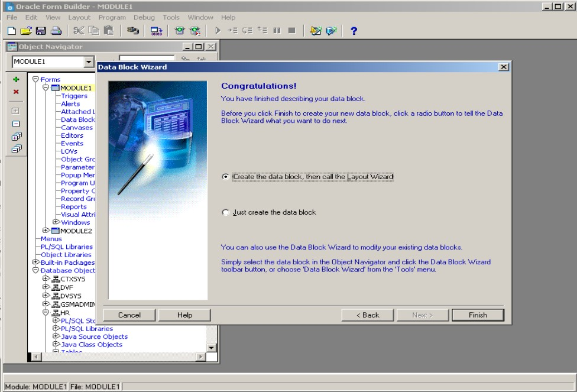  
<p align="center">Pic 12.3.6: Forms Builder. Create data block</p>  


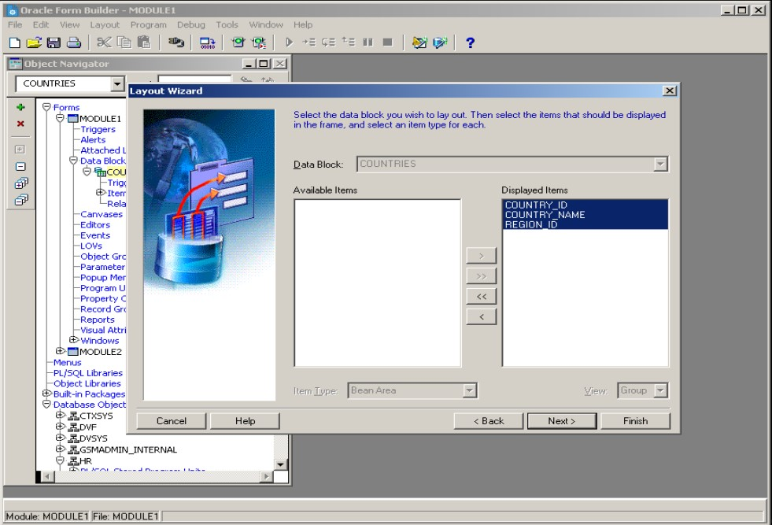  
<p align="center">Pic 12.3.7: Forms Builder. Create data block</p>  


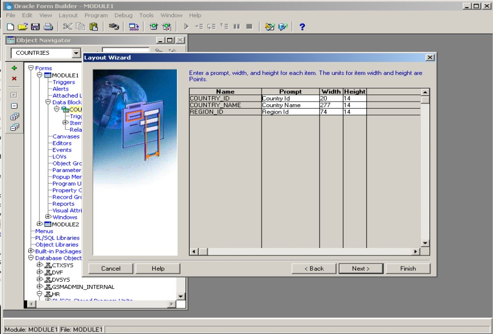  
<p align="center">Pic 12.3.8: Forms Builder. Create data block</p>  


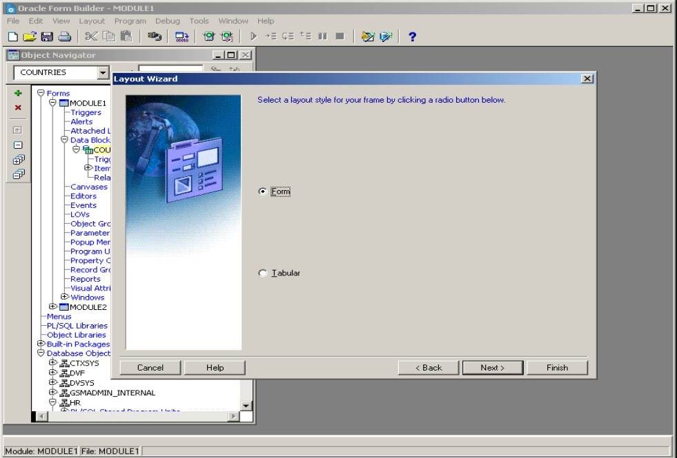  
<p align="center">Pic 12.3.9: Forms Builder. Create data block</p>  

Save your form to folder that in the FORMS_MODULE_PATH (see chapter 10)  


### 12.4. Set up Application Server URL  
Navigation: Forms Builder > Edit > Preferences > Runtime tab  
Set value for  "Application Server URL" field: http://localhost:9001/forms/frmservlet?config=webstart  
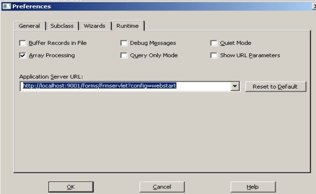  
<p align="center">Pic 12.4: Forms Builder. Set up Application Server URL</p>  


### 12.5. Run Form  
Navigation: Forms Builder > Program > Run Form  
Open jnpl file (OK button)  
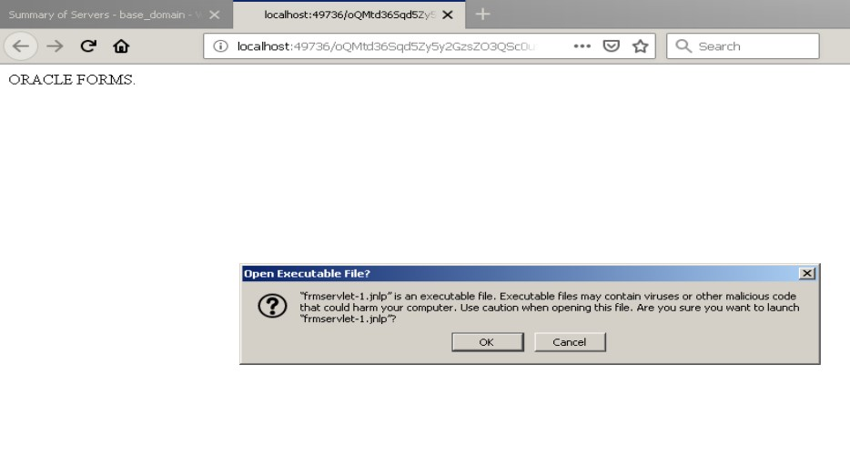  
<p align="center">Pic 12.5.1: Run Form</p>  


Run Oracle Form (Run button)  
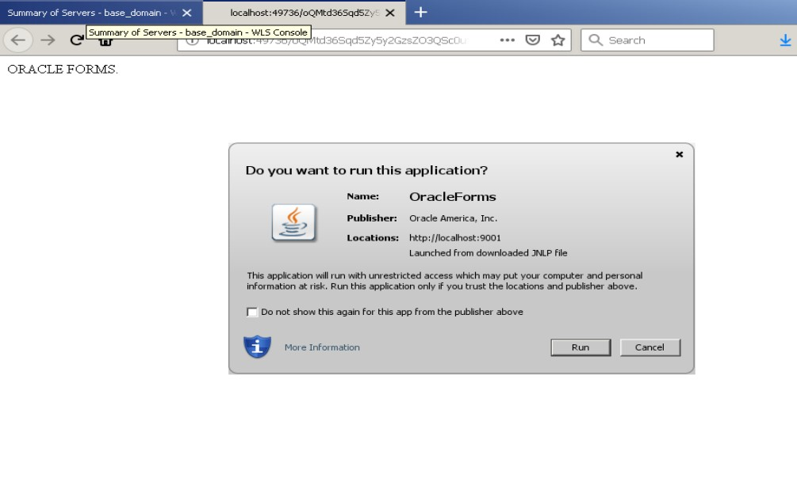  
<p align="center">Pic 12.5.2: Run Form</p>  

Runned Form Look like this:  
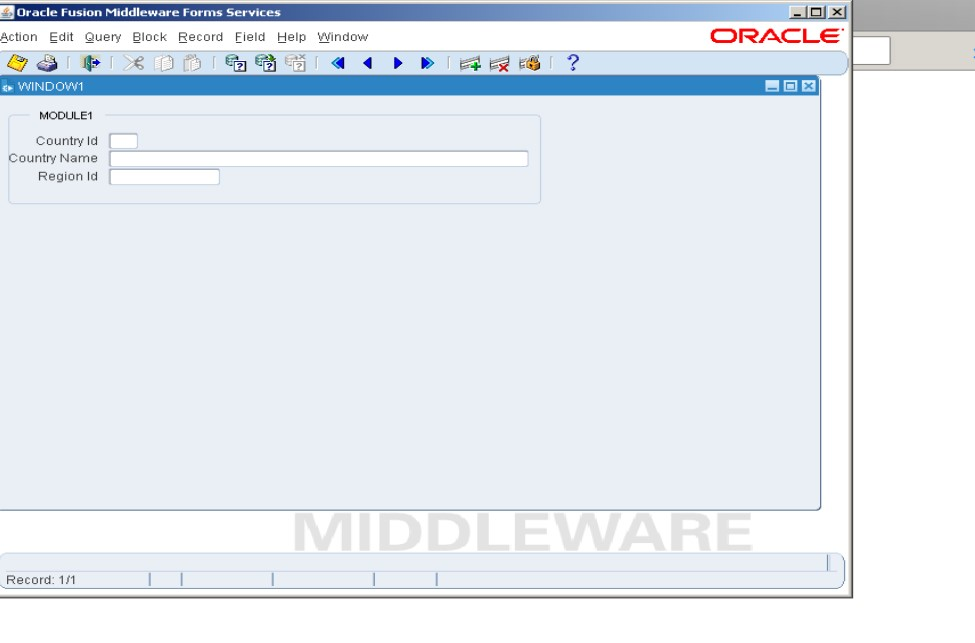  
<p align="center">Pic 12.5.3: Run Form</p>  


References:  
Documentation: https://docs.oracle.com/midrdleware/12213/formsandreports/index.html  
System requirements: https://www.oracle.com/technetwork/middleware/fmw-122130-certmatrix-3867828.xlsx  
Download Oracle JDK 1.8.0_131: https://www.oracle.com/technetwork/java/javase/downloads/java-archive-javase8-2177648.html  
Download Application Development Runtime 12.2.1.3: https://www.oracle.com/technetwork/developer-tools/adf/downloads/index.html  
Download Microsoft Visual C++: https://www.microsoft.com/en-us/download/details.aspx?id=30679  


