# Start with the Oracle Forms/Reports 12.2.1.3
Environment:  
VirtualBox machine 4Gb Memory  
OS Windows 7 SP1 Professional 64bit  
Oracle XE 18c for FMW Repository(Fusion Middleware Repository)  

## 1.Check system requirements
link: https://www.oracle.com/technetwork/middleware/fmw-122130-certmatrix-3867828.xlsx  
## 2.Download software  
### 2.1.Oracle JDK 1.8.0_131
link: https://www.oracle.com/technetwork/java/javase/downloads/java-archive-javase8-2177648.html  
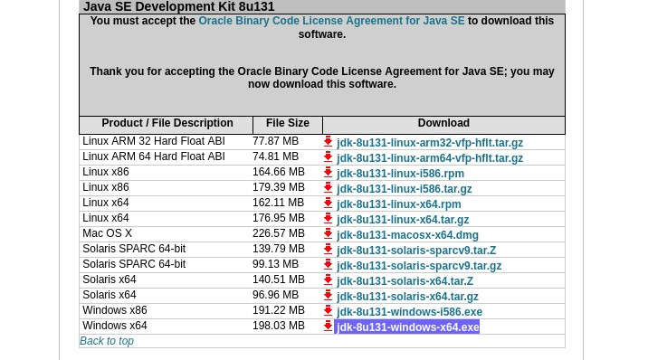  


### 2.2.Microsoft Visual C++  
link: https://www.microsoft.com/en-us/download/details.aspx?id=30679  
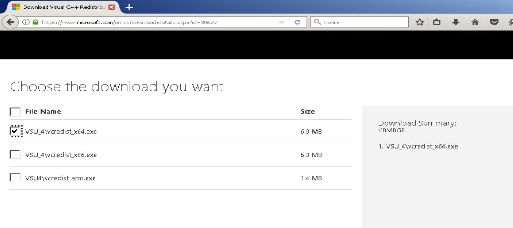  


### 2.3.ADF(Application Development Framework) Infrastructure 12.2.1.3
link: https://www.oracle.com/technetwork/developer-tools/adf/downloads/index.html  
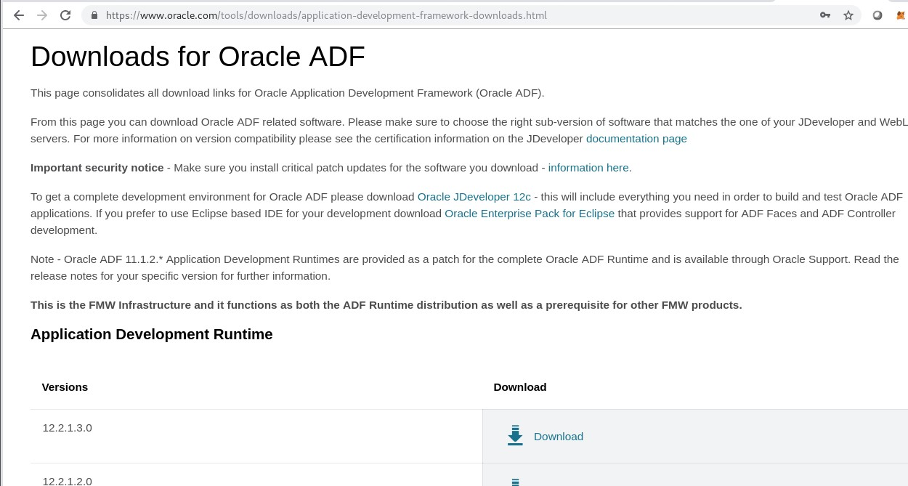  


### 2.4.Oracle Forms 
link: https://www.oracle.com/downloads/
navigation:  “Developer Downloads” chapter > “Middleware” chapter > "Forms and Reports Services" link  
  
<p align="center">Pic 3: Oracle Forms Download</p>  


  
<p align="center">Pic 5: Oracle Forms Download, edelivery.oracle.com</p>  


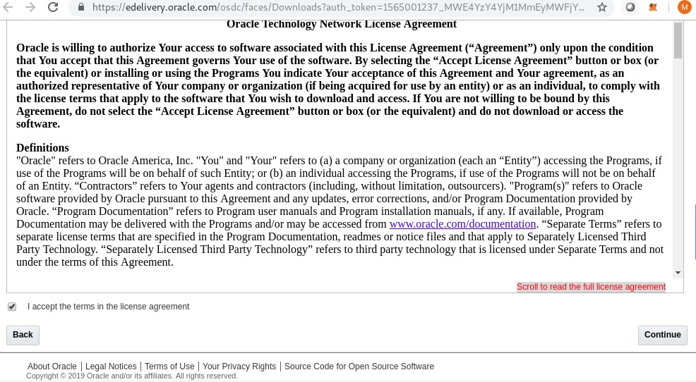  
<p align="center">Pic 6: License Agreement</p>  


  
<p align="center">Pic 7: Forms Download, zip files, edelivery.oracle.com</p>  


Unzip both zip files into thee same folder  


## 3.Install Oracle JDK to the folder with the "8.3" name  
"8.3" name means following: https://en.wikipedia.org/wiki/8.3_filename  
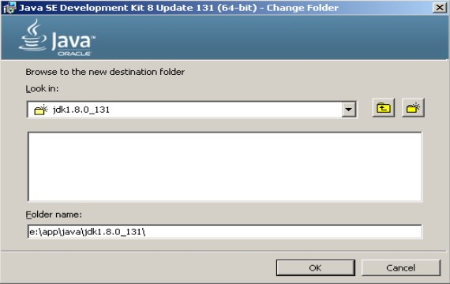  
<p align="center">Pic 8: JDK folder name</p>  


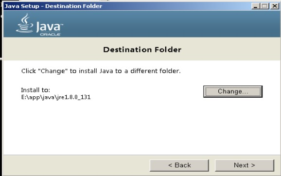  
<p align="center">Pic 9: JRE folder name</p>  


## 4.Install Microsoft Visual C++  
Restart computer after installation of Microsoft Visual C++  


## 5.Install ADF Infrastructure   
Run cmd as Administrator  
Change directory to the folder with unpacked ADF Infrastructure distro  
Run ADF Infrastructure Installer. Example:  
```
e:\app\java\jdk1.8.0_131\bin\java.exe -jar fmw_12.2.1.3.0_infrastructure.jar
```
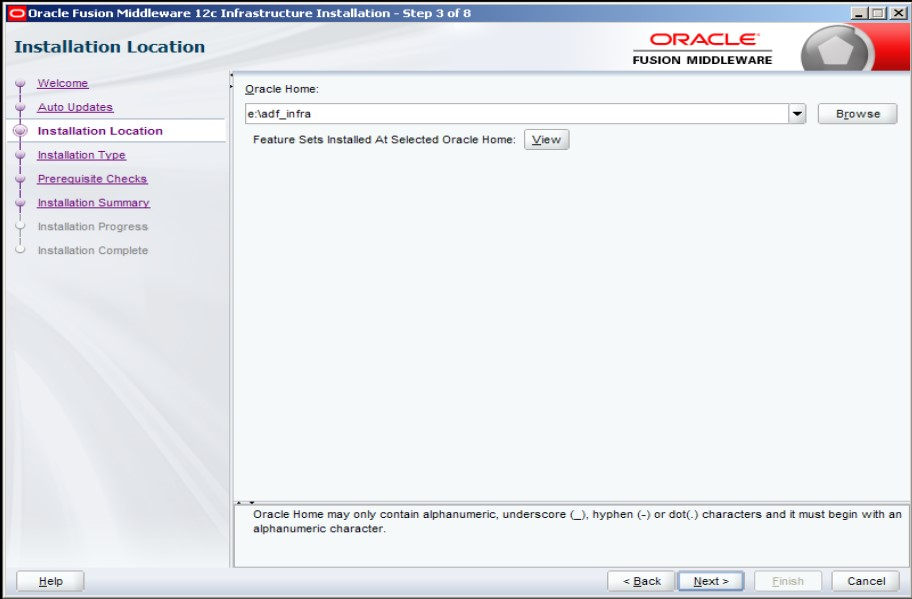  
<p align="center">Pic 10: ADF Infrastructure Installation. Select Oracle Home folder</p>  


## 6.Install Oracle Forms 12.2.1.3  
run setup_fmw_12.2.1.3.0_fr_win64.exe as Administrator  
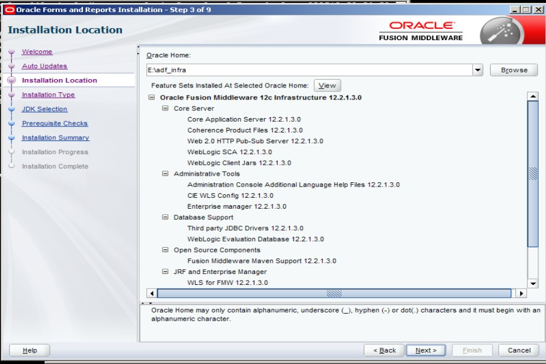  
<p align="center">Pic 11: Forms Installation. Select ADF Infrastructure Oracle Home</p>  

Select installation type: Forms and Reports Deployment  
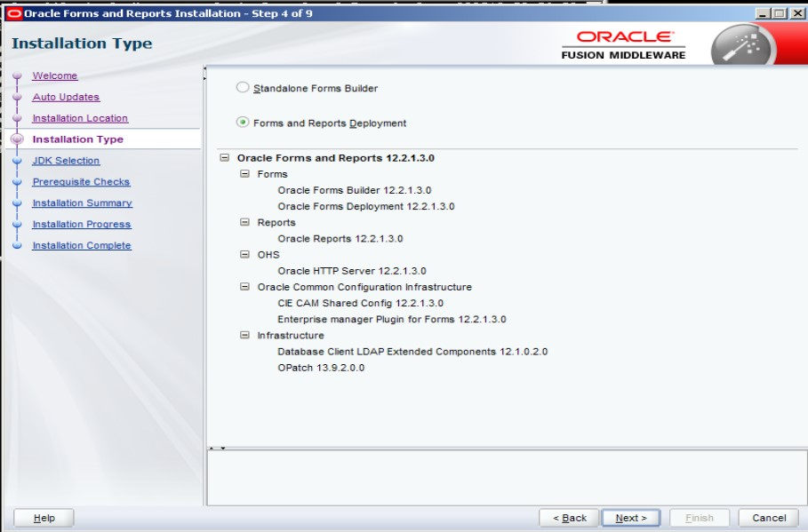  
<p align="center">Pic 12: Forms Installation. Select Installation type</p>  


Select JDK  
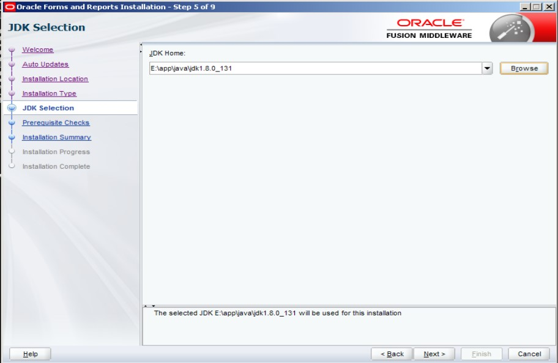  
<p align="center">Pic 13: Forms Installation. JDK selection</p>  


## 7.Create Fusion Middleware Repository

Run Repository Creation Utility(RCU) from ADF Infrastructure ORACLE_HOME\oracle_common\bin\rcu.bat  
Select "System Load and Product Load"  
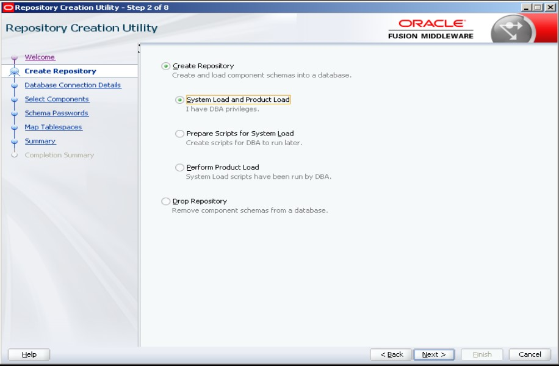  
<p align="center">Pic 14: RCU. Select "System Load and Product Load"</p>  


Edit database connection details  
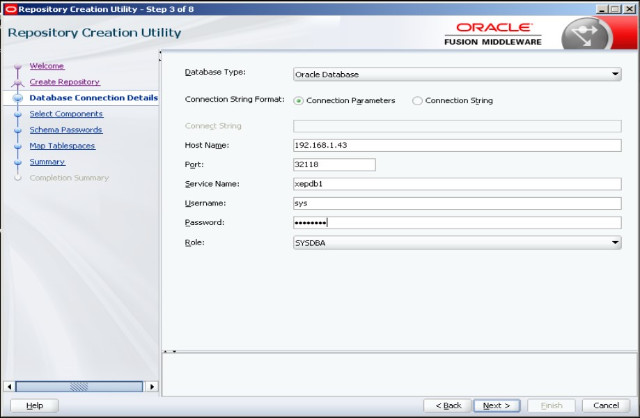  
<p align="center">Pic 15: RCU. Detabase Connection Details</p>  

Provide schema prefix and select following components:  
- Oracle Platform Security Services  
- User Messaging Service (UMS)  
- Audit Services  
- Audit Services Append  
- Audit Services Viewer  
Additional dependent components will automatically be selected  
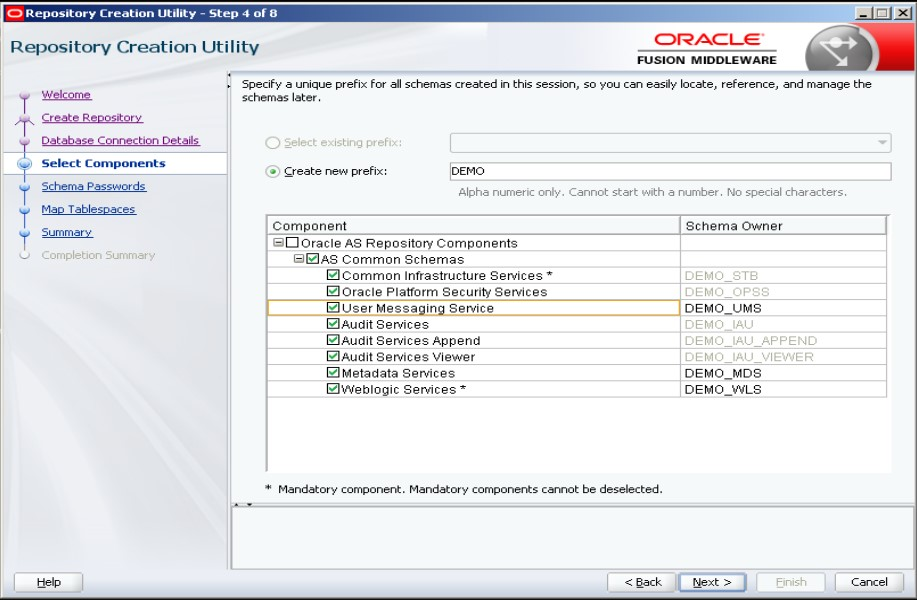  
<p align="center">Pic 16: RCU. Select Components</p>  
Then set schema passwords, map tablespaces and waiting until load processes will complete

## 8.Configure Fusion Middleware Services
Run Configuration Wizard from ADF Infrastructure ORACLE_HOME\oracle_common\common\bin\config.cmd


References:  
Documentation: https://docs.oracle.com/middleware/12213/formsandreports/index.html  
System requirements: https://www.oracle.com/technetwork/middleware/fmw-122130-certmatrix-3867828.xlsx  
Download Oracle JDK 1.8.0_131: https://www.oracle.com/technetwork/java/javase/downloads/java-archive-javase8-2177648.html  
Download Application Development Runtime 12.2.1.3: https://www.oracle.com/technetwork/developer-tools/adf/downloads/index.html  
Download Microsoft Visual C++: https://www.microsoft.com/en-us/download/details.aspx?id=30679  


