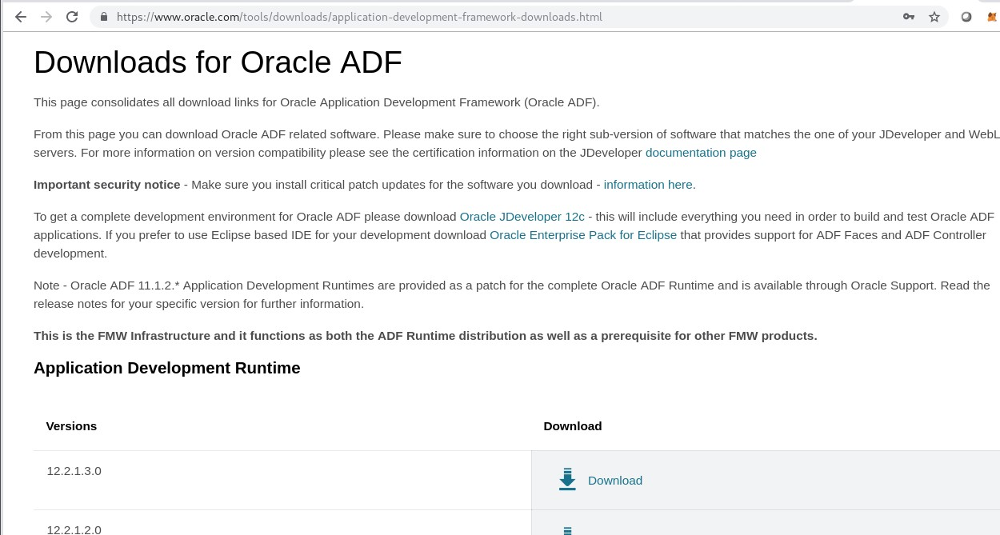
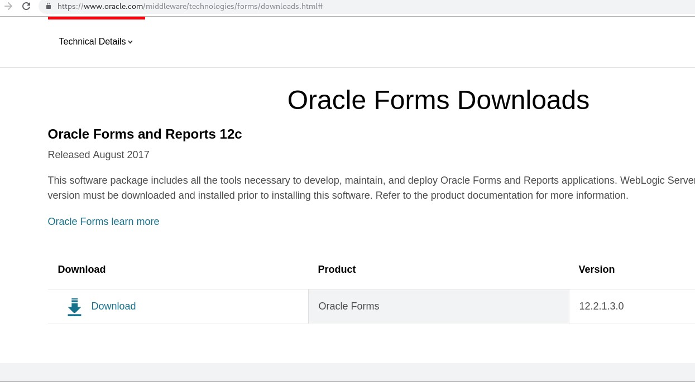

**HOWTO Install Oracle Forms/Reports 12.2.1.3 on Windows 7 SP1**  
Environment:  
VirtualBox machine 4Gb Memory  
OS Windows 7 SP1 Professional 64bit  

1.Check system requirements, https://www.oracle.com/technetwork/middleware/fmw-122130-certmatrix-3867828.xlsx  
2.Download software  
2.1.Oracle JDK 1.8.0_131, https://www.oracle.com/technetwork/java/javase/downloads/java-archive-javase8-2177648.html  
  
2.2.Application Development Runtime 12.2.1.3 https://www.oracle.com/technetwork/developer-tools/adf/downloads/index.html  
  
2.3.Oracle Forms https://www.oracle.com/downloads/,  “Developer Downloads” chapter > “Middleware” chapter > "Forms and Reports Services" link  
  

Oracle Forms Download
  
  
  
  

References:  
Documentation https://docs.oracle.com/middleware/12213/formsandreports/index.html  
System requirements https://www.oracle.com/technetwork/middleware/fmw-122130-certmatrix-3867828.xlsx  
Download Oracle JDK 1.8.0_131 https://www.oracle.com/technetwork/java/javase/downloads/java-archive-javase8-2177648.html  
Download Application Development Runtime 12.2.1.3 https://www.oracle.com/technetwork/developer-tools/adf/downloads/index.html  

