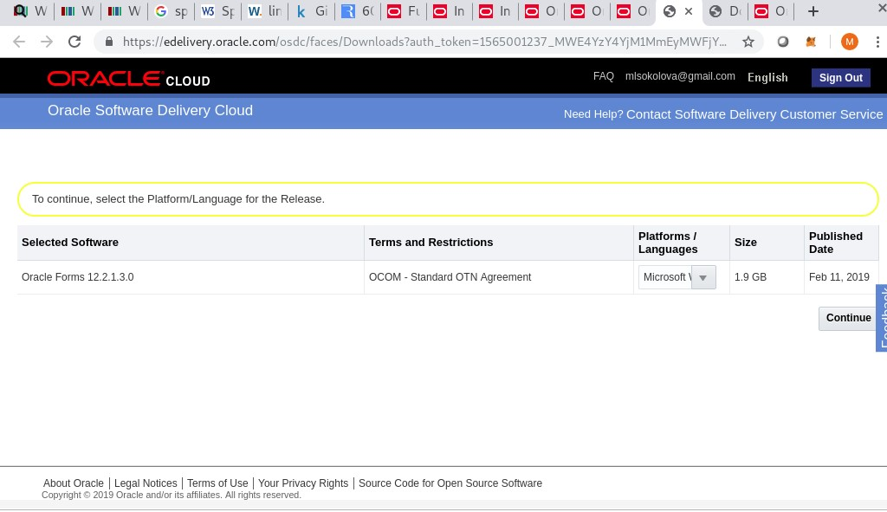
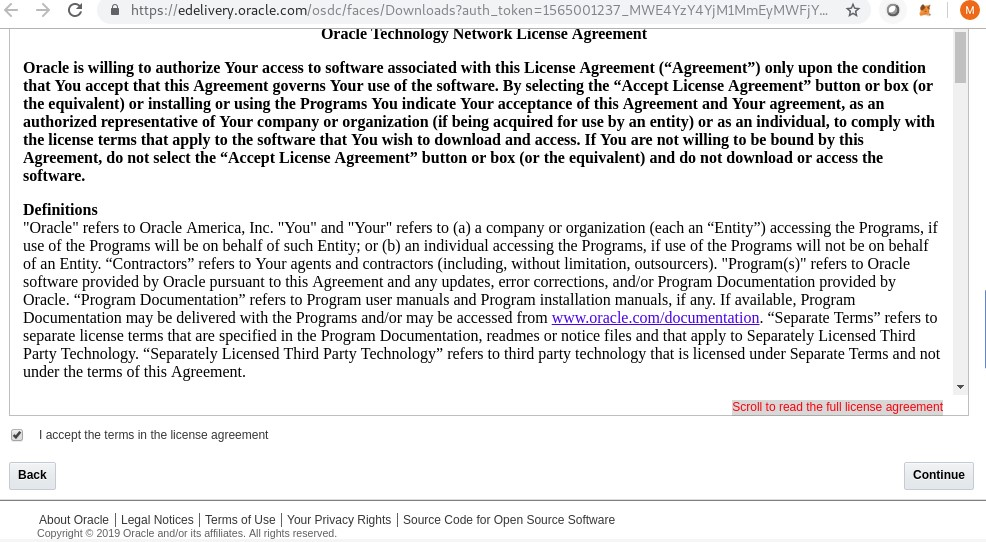
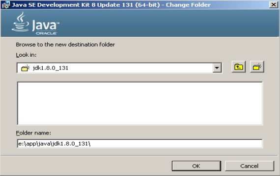
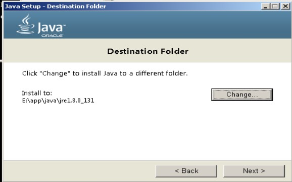

**HOWTO Install Oracle Forms/Reports 12.2.1.3 on Windows 7 SP1**  
Environment:  
VirtualBox machine 4Gb Memory  
OS Windows 7 SP1 Professional 64bit  

1.Check system requirements, https://www.oracle.com/technetwork/middleware/fmw-122130-certmatrix-3867828.xlsx  
2.Download software  
2.1.Oracle JDK 1.8.0_131, https://www.oracle.com/technetwork/java/javase/downloads/java-archive-javase8-2177648.html  
  
2.2.Microsoft Visual C++ https://www.microsoft.com/en-us/download/details.aspx?id=30679  
  
2.3.Application Development Runtime 12.2.1.3 https://www.oracle.com/technetwork/developer-tools/adf/downloads/index.html  
  
2.4.Oracle Forms https://www.oracle.com/downloads/,  “Developer Downloads” chapter > “Middleware” chapter > "Forms and Reports Services" link  
  

Pic 3: Oracle Forms Download
  

  

Pic 5: Oracle Forms Download, edelivery.oracle.com
  

  

Pic 6: License Agreement
  

  

Pic 7: Forms Download, zip files, edelivery.oracle.com
  

3.Install Oracle JDK to the folder with the "8.3" name 
"8.3" name means following: https://en.wikipedia.org/wiki/8.3_filename
  

Pic 8: JDK folder name
  

  

Pic 9: JRE folder name
  

4.Install Microsoft Visual C++
Restart computer after installation of Microsoft Visual C++

References:  
Documentation: https://docs.oracle.com/middleware/12213/formsandreports/index.html  
System requirements: https://www.oracle.com/technetwork/middleware/fmw-122130-certmatrix-3867828.xlsx  
Download Oracle JDK 1.8.0_131: https://www.oracle.com/technetwork/java/javase/downloads/java-archive-javase8-2177648.html  
Download Application Development Runtime 12.2.1.3: https://www.oracle.com/technetwork/developer-tools/adf/downloads/index.html  
Download Microsoft Visual C++: https://www.microsoft.com/en-us/download/details.aspx?id=30679  

